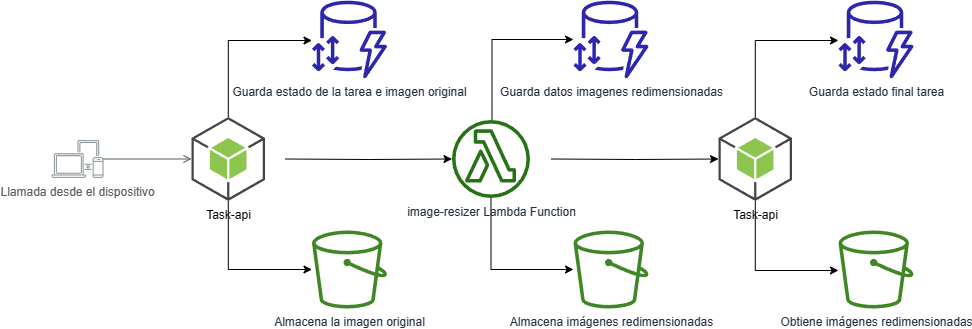
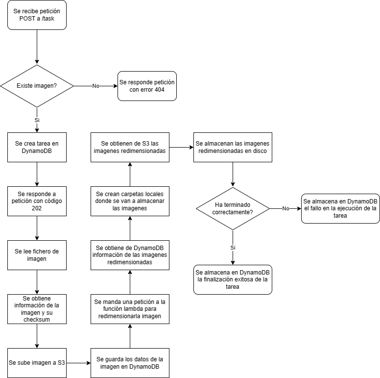

# Image resizer
Este proyecto consiste en un REST API y una función AWS Lambda que genera imagenes redimensionadas a partir de una imagen. En este proyecto se hace uso de los siguientes servicios de AWS:

- **AWS S3**: Aquí almacenaremos las imagenes con la que se trabajarán, tanto los archivos originales como los redimensionados.
- **AWS DynamoDB**: Utilizaremos dos tablar para mantener información tanto de las imagenes como de las tareas en ejecución.
- **AWS Lambda**: Usaremos Lambda para leer una imagen de S3, redimensionarla y almacenar las imagenes resultantes nuevamente en S3.

El proyecto lo compone de:
- **REST API**: Aplicación de NodeJS que puede ser ejecutada de forma local. Este API esta realizada siguiendo Domain-driven design con una arquitectura hexagonal.
- **Función de reescalado**: Es una función lambda. Esta función hace uso de streams para mejorar la velocidad de creación de las imágenes redimensionadas. Utiliza serverless para el despliegue en AWS.

Ambas aplicaciones han sido desarrolladas en typescript.




### Requisitos
Para poder ejecutar este proyecto es necesario la creación de un usuario AWS. No se han definido los roles necesarios para la ejecución de la demo, se puede dar permisos de `AdministratorAccess` pero no es una práctica recomendada.

Debemos instalar el CLI de AWS ([más info aquí](https://docs.aws.amazon.com/es_es/cli/latest/userguide/getting-started-install.html)) y configurar el usuario mediante la ejecución del siguiente comando:

```
aws configure
```

Es necesario crear un bucket de S3 y dos tablas de DynamoDB (una para las imágenes y otra para las tareas), las cuales tendrán por Partition Key el valor `id`. También devemos de especificar [un provider AWS](https://app.serverless.com/settings/providers) en la web de serverless.

## Task API
Esta es una aplicación de NodeJS que puede ser ejecutada en local.

### Endpoints

**POST** http://localhost:3000/task. Tiene un body con el siguiente contenido:
```
{
	"imagePath": "image1.jpg"
}
```
ImagePath será un archivo que se encuentre en la carpeta `images` del proyecto. No se ha incluido ningún sistema de subida de ficheros para la demostración

En caso de encontrar el archivo devolverá un código 202 con un objeto con el siguiente contenido:
```
{
  "id": "65dc58e5-ec98-42b7-b77f-d037db2f3738",
  "path": "image1.jpg",
  "updatedAt": "1689013379126",
  "status": "Completed"
}
```

El funcionamiento del endpoint es el siguiente:


**GET** http://localhost:3000/task/[task-id]. Si se encuentra la tarea devolverá un código 200 con un objeto con el siguiente contenido:
```
{
  "id": "65dc58e5-ec98-42b7-b77f-d037db2f3738",
  "path": "image1.jpg",
  "updatedAt": "1689013379126",
  "status": "Completed"
}
```

### Configuración
Para arrancar el proyecto es necesario instalar la dependencias ejecutando el siguiente comando dentro de la carpeta de `task-api`:
```
npm i
```

Es necesario configurar los datos de acceso de AWS en el archivo de configuración. El archivo por defecto es default.yml. El proyecto hace uso de la librería `config`. La configuración por defecto es la siguiente:
```
aws:
  lambda:
    region: eu-west-1
    accessKeyId: <AWS KEY ID>
    secretAccessKey: <AWS Secret KEY>
    paths:
      resize: <lamda API Path>
  s3:
    region: eu-west-1
    accessKeyId: <AWS KEY ID>
    secretAccessKey: <AWS Secret KEY>
    bucket: <S3 bucket>
  dynamodb:
    region: eu-west-1
    accessKeyId: <AWS KEY ID>
    secretAccessKey: <AWS Secret KEY>
    tables:
      images: images
      tasks: tasks
server:
  port: 3000
logger:
  level: info
```


Para ejecutar el proyecto habría que ejecutar el siguiente comando:
```
npm run dev
```

## resizer-aws
Esta aplicación contiene un AWS Lambda para el redimensionado de la imagen. Esta aplicación está compuesta por una función Lambda de AWS que va a generar una entrada en un API rest, de path `/resize` y método `POST`, que tiene por body un json con el siguiente formato:

```
{
	"imageId": "uuid"
}
```

Una vez se recibe una petición, el script buscará en DynamoDB un documento que tenga por ID el imageId recibido en el body de la petición. Una vez encontrado, con la propiedad path del documento se buscará en S3 ese archivo. Una vez obtenido se redimensionará en dos imagenes, una de 1000 pixeles y otra de 800 pixeles. Se obtendrá información del tamaño final de cada archivo redimensionado, se obtendrá su checksum y se almacenará la información en DynamoDB teniendo como parentId el ID de la imagen original.

Para realizar el redimensionado y obtención de información se ha hecho uso de streams, lo que permite una ejecución eficiente con los mínimos bloqueos posibles para el redimensionado de las dos imágenes y la obtención de la información. Se utiliza serverless para el despliegue de la aplicación.

### Requisitos AWS
Debido a la naturaleza del test no se ha hecho hincapie en la granulación de permisos de AWS. Es necesario la creación de un usuario que tenga permisos de administrador.

Se han creado dos tablas DynamoDB desde la interfaz, una de nombre `images` y otra de nombre `tasks`.


### Configuración
En el archivo serverless.yml tenemos que definir la región y el Bucket de S3.

### Despliegue
Para el despliegue de la aplicación necesitamos abrir un cmd dentro de la carpeta de resizer-aws y ejecutar:
```
npm i
```

```
npm run deploy
```

Una vez hecho el deploy nos aparecera el endpoint de la lambda function, esa url la debemos copiar en la configuración de task-api, concretamente en `aws.lambda.paths.resize`.
